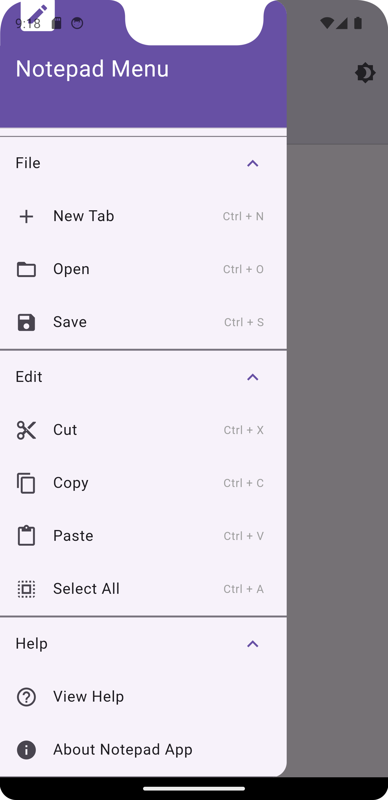
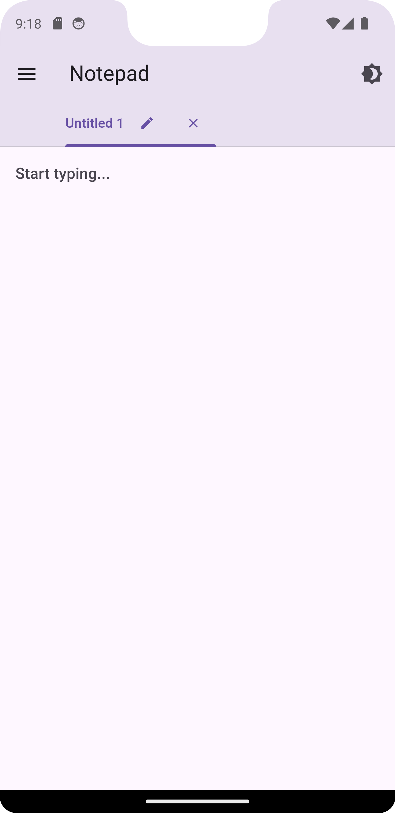

# Notepad App

A lightweight and user-friendly notepad app built with Flutter, leveraging the Hive database for local data storage. It features multiple tabs, light/dark mode, and keyboard shortcuts for enhanced productivity.

## Features
- **Multi-Tab Interface**: Create, rename, and close tabs for organizing your notes.
- **Dark Mode**: Toggle between light and dark themes.
- **Keyboard Shortcuts**: Boost productivity with intuitive shortcuts:
  - `Ctrl + N`: Create a new tab
  - `Ctrl + S`: Save the current note
  - `Ctrl + O`: Open an existing note
  - `Ctrl + X`: Cut text
  - `Ctrl + C`: Copy text
  - `Ctrl + V`: Paste text
  - `Ctrl + A`: Select all text in the current tab
- **Persistent Storage**: Save and retrieve notes locally with Hive.

## How to Use
1. Create a new tab using the `+` button or `Ctrl + N`.
2. Start typing in the text editor. Notes are automatically saved.
3. Rename tabs by clicking the edit icon on the tab.
4. Toggle dark mode using the sun/moon icon in the top-right corner.
5. Access help and about sections from the drawer menu.

## Screenshots
### Home Screen


### Multi-Tab Interface


### Dark Mode


## Setup and Installation
1. Clone the repository.
2. Install the required dependencies:
   ```
   flutter pub get
   ```
3. Run the app:
   ```
   flutter run
   ```

## Dependencies
- **Hive**: Lightweight and fast NoSQL database for Flutter.
- **Hive Flutter**: Hive integration for Flutter.

## License
This project is licensed under the MIT License. See the LICENSE file for details.

---

Developed by CodēCodes.
